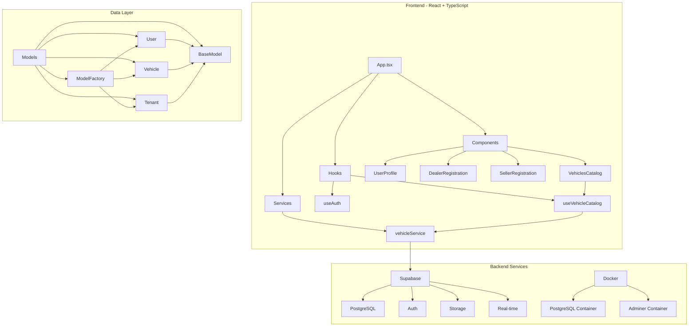
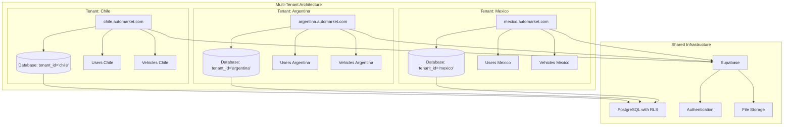
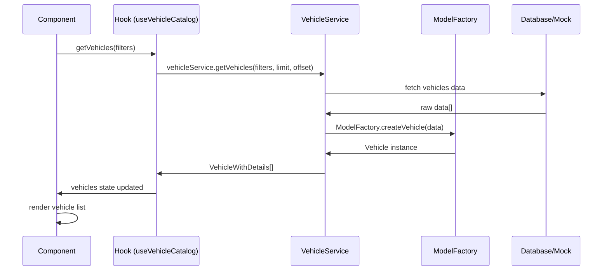
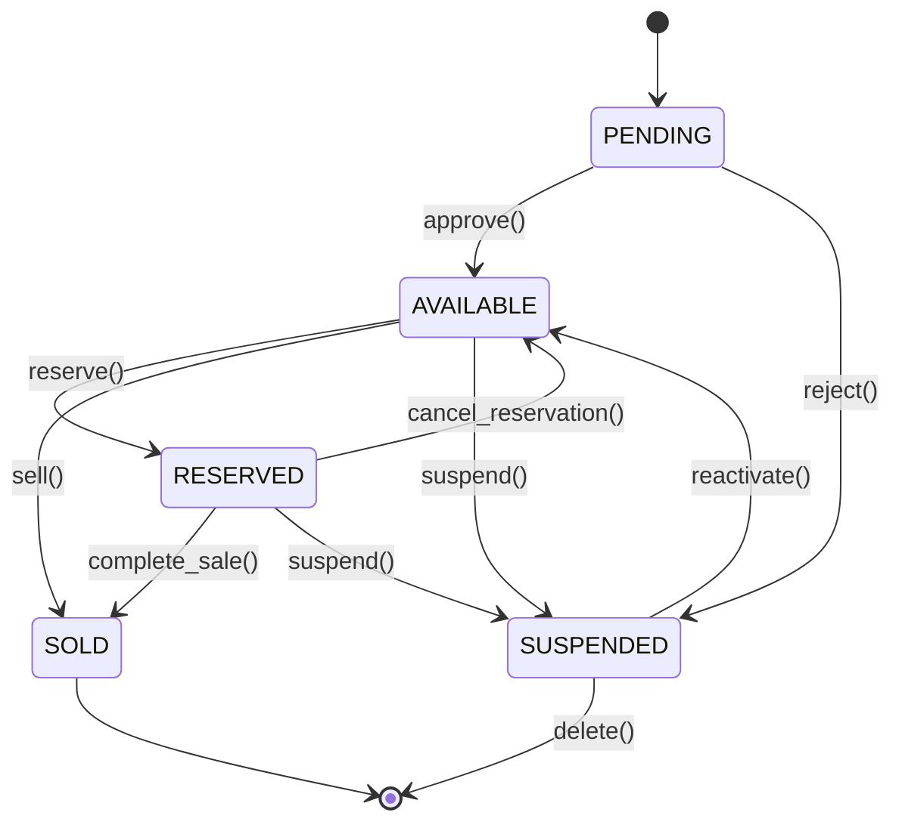
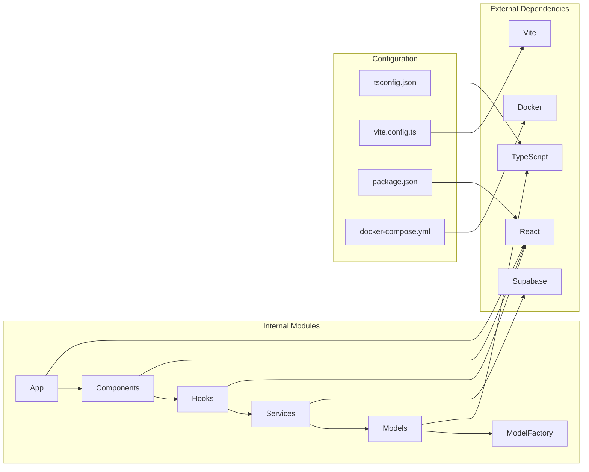

# Diagramas del Proyecto Automarket Multitenant

## 1. Arquitectura General del Sistema



## 2. Modelo de Datos - Diagrama de Clases

```mermaid
classDiagram
    class BaseModel {
        <<abstract>>
        +id: string
        +created_at: Date
        +updated_at: Date
        +generateId(): string
        +touch(): void
        +toDatabase(): Record~string, any~*
        +validate(): ValidationResult*
        +toJSON(): Record~string, any~
    }
    
    class User {
        +tenant_id: string
        +email: string
        +phone?: string
        +user_type: UserType
        +status: UserStatus
        +email_verified_at?: Date
        +phone_verified_at?: Date
        +create(data: CreateUserData): User$
        +activate(): void
        +suspend(): void
        +verifyEmail(): void
        +verifyPhone(): void
        +changeUserType(type: UserType): void
        +isActive(): boolean
        +isVerified(): boolean
        +toDatabase(): Record~string, any~
        +validate(): ValidationResult
    }
    
    class Vehicle {
        +tenant_id: string
        +seller_id: string
        +make: string
        +model: string
        +year: number
        +price: number
        +currency: string
        +mileage: number
        +fuel_type: FuelType
        +transmission: TransmissionType
        +body_type: BodyType
        +color: string
        +description?: string
        +status: VehicleStatus
        +images: VehicleImage[]
        +features: VehicleFeature[]
        +location_city?: string
        +location_state?: string
        +vin?: string
        +license_plate?: string
        +create(data: CreateVehicleData): Vehicle$
        +updatePrice(newPrice: number): void
        +addImage(image: VehicleImage): void
        +removeImage(imageId: string): void
        +addFeature(feature: VehicleFeature): void
        +removeFeature(featureName: string): void
        +calculateDepreciation(): number
        +isAvailableForSale(): boolean
        +getPrimaryImage(): VehicleImage | null
        +markAsAvailable(): void
        +markAsSold(): void
        +markAsReserved(): void
        +toDatabase(): Record~string, any~
        +validate(): ValidationResult
    }
    
    class Tenant {
        +name: string
        +slug: string
        +country_code: string
        +currency: string
        +timezone: string
        +status: TenantStatus
        +create(data: CreateTenantData): Tenant$
        +activate(): void
        +deactivate(): void
        +setMaintenance(): void
        +updateCurrency(currency: string): void
        +updateTimezone(timezone: string): void
        +isActive(): boolean
        +generateSlug(): string
        +toDatabase(): Record~string, any~
        +validate(): ValidationResult
    }
    
    class ModelFactory {
        <<utility>>
        +createUser(data: any): User$
        +createVehicle(data: any): Vehicle$
        +createTenant(data: any): Tenant$
    }
    
    BaseModel <|-- User
    BaseModel <|-- Vehicle
    BaseModel <|-- Tenant
    ModelFactory ..> User : creates
    ModelFactory ..> Vehicle : creates
    ModelFactory ..> Tenant : creates
```



## 3. Diagrama de Arquitectura Multi-Tenant



## 4. Flujo de Datos - Vehicle Service



## 5. Diagrama de Estados - Vehicle



## 6. Estructura de Carpetas

```
📁 automarket-multitenant/
├── 📁 app/                          # Frontend React
│   ├── 📁 src/
│   │   ├── 📁 models/               # Domain Models
│   │   │   ├── 📄 BaseModel.ts      # Abstract base class
│   │   │   ├── 📄 User.ts           # User model
│   │   │   ├── 📄 Vehicle.ts        # Vehicle model
│   │   │   ├── 📄 Tenant.ts         # Tenant model
│   │   │   └── 📄 index.ts          # ModelFactory + exports
│   │   ├── 📁 services/             # Business Logic Layer
│   │   │   └── 📄 vehicleServiceNew.ts # Vehicle operations
│   │   ├── 📁 hooks/                # React Hooks
│   │   │   ├── 📄 useAuth.ts        # Authentication
│   │   │   └── 📄 useVehicleCatalog.ts # Vehicle catalog
│   │   ├── 📁 components/           # UI Components
│   │   │   ├── 📄 VehiclesCatalog.tsx
│   │   │   ├── 📄 UserProfile.tsx
│   │   │   ├── 📄 DealerRegistration.tsx
│   │   │   └── 📄 SellerRegistration.tsx
│   │   ├── 📁 lib/                  # External Services
│   │   │   ├── 📄 supabase.ts       # Supabase client
│   │   │   └── 📄 database.types.ts # DB type definitions
│   │   ├── 📁 utils/                # Utilities & Testing
│   │   │   ├── 📄 quickTest.ts      # Model tests
│   │   │   ├── 📄 modelsDemo.ts     # Demo scenarios
│   │   │   └── 📄 nodeTest.js       # Node.js test
│   │   ├── 📄 App.tsx               # Main component
│   │   ├── 📄 main.tsx              # Entry point
│   │   └── 📄 vite-env.d.ts         # Vite types
│   ├── 📄 package.json              # Dependencies
│   ├── 📄 tsconfig.json             # TypeScript config
│   ├── 📄 vite.config.ts            # Vite config
│   └── 📄 index.html                # HTML template
├── 📁 api/                          # Backend API (Future)
├── 📁 db/                           # Database scripts
│   └── 📄 init.sql                  # Initial schema
├── 📁 supabase/                     # Supabase config
│   └── 📄 schema.sql                # Database schema
├── 📄 docker-compose.yml            # Docker services
├── 📄 README.md                     # Project documentation
└── 📄 RESUMEN_COMPLETO.txt          # Complete summary
```

## 7. Diagrama de Dependencias



## 8. Diagrama de Casos de Uso

```mermaid
graph TB
    subgraph "Actores"
        B[Buyer - Comprador]
        S[Seller - Vendedor]
        D[Dealer - Concesionario]
        A[Admin - Administrador]
    end
    
    subgraph "Casos de Uso - Buyer"
        UC1[Buscar Vehículos]
        UC2[Filtrar por Criterios]
        UC3[Ver Detalles del Vehículo]
        UC4[Agregar a Favoritos]
        UC5[Contactar Vendedor]
    end
    
    subgraph "Casos de Uso - Seller"
        UC6[Registrar Vehículo]
        UC7[Actualizar Información]
        UC8[Subir Imágenes]
        UC9[Gestionar Consultas]
        UC10[Marcar como Vendido]
    end
    
    subgraph "Casos de Uso - Dealer"
        UC11[Gestionar Inventario]
        UC12[Publicar Multiple Vehículos]
        UC13[Gestionar Perfil de Empresa]
        UC14[Ver Estadísticas]
    end
    
    subgraph "Casos de Uso - Admin"
        UC15[Gestionar Tenants]
        UC16[Moderar Contenido]
        UC17[Ver Analytics]
        UC18[Configurar Sistema]
    end
    
    B --> UC1
    B --> UC2
    B --> UC3
    B --> UC4
    B --> UC5
    
    S --> UC6
    S --> UC7
    S --> UC8
    S --> UC9
    S --> UC10
    
    D --> UC11
    D --> UC12
    D --> UC13
    D --> UC14
    
    A --> UC15
    A --> UC16
    A --> UC17
    A --> UC18
```

