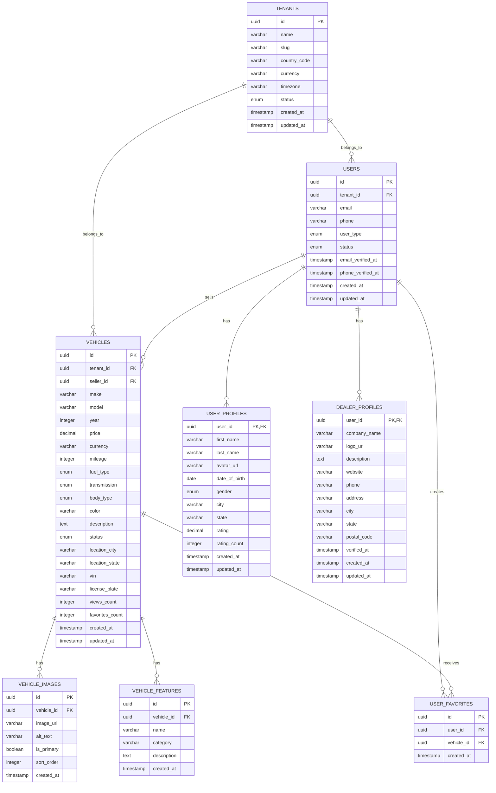
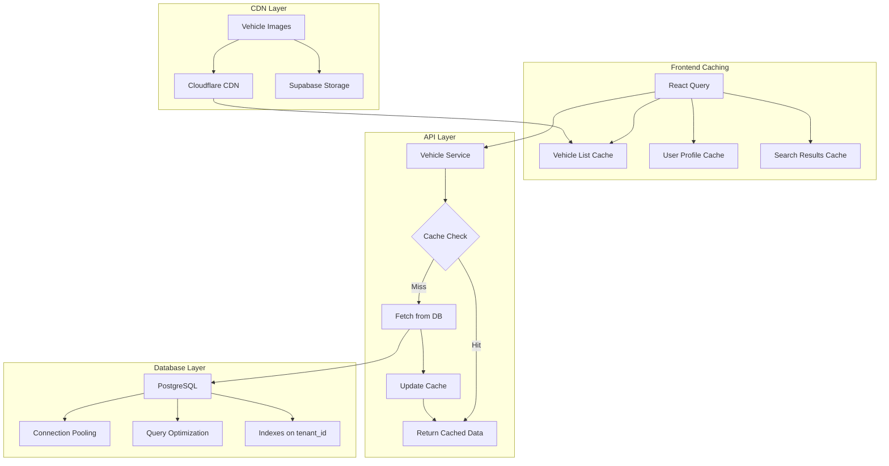
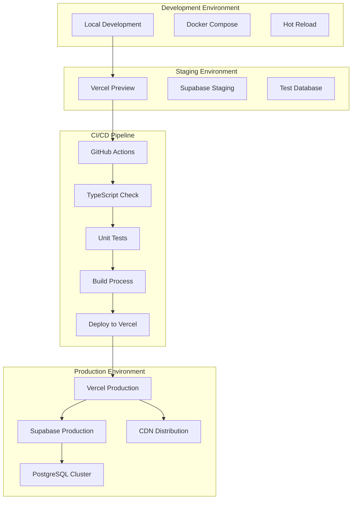
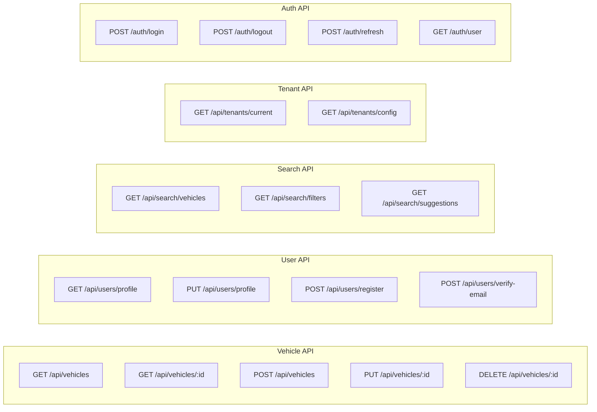
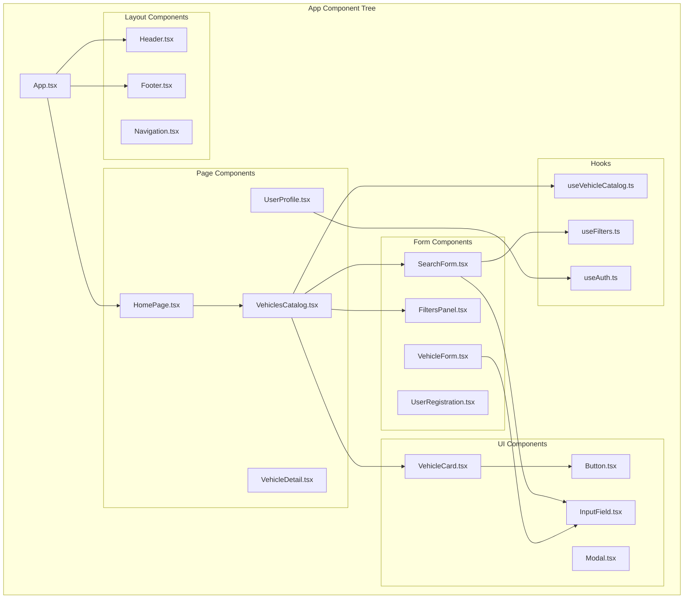
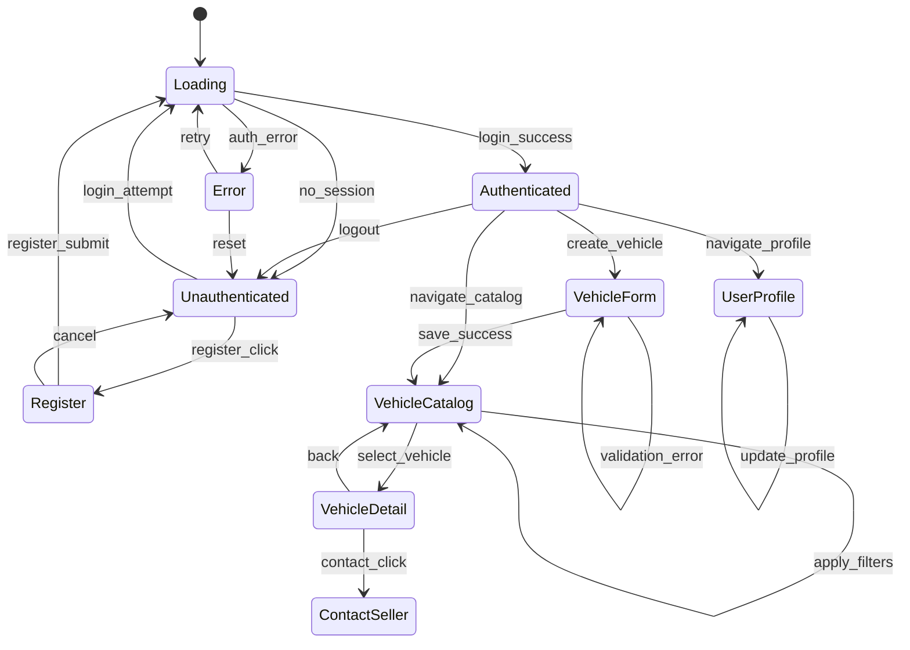

# Diagramas Avanzados - Automarket Multitenant

## 9. Diagrama de Base de Datos (ERD)



## 10. Diagrama de Seguridad - Row Level Security (RLS)

```mermaid
graph TB
    subgraph "RLS Policies"
        P1[Users Policy: tenant_id = current_tenant()]
        P2[Vehicles Policy: tenant_id = current_tenant()]
        P3[Profiles Policy: user_id = auth.uid()]
        P4[Favorites Policy: user_id = auth.uid()]
    end
    
    subgraph "Authentication Flow"
        A1[User Login] --> A2[JWT Token]
        A2 --> A3[Supabase Auth]
        A3 --> A4[Set tenant_id in JWT]
        A4 --> A5[RLS Enforcement]
    end
    
    subgraph "Data Access Control"
        D1[Query Request] --> D2{Check RLS Policy}
        D2 -->|Pass| D3[Return Data]
        D2 -->|Fail| D4[Access Denied]
    end
    
    A5 --> D2
    P1 --> D2
    P2 --> D2
    P3 --> D2
    P4 --> D2
```

## 11. Diagrama de Performance - Caching Strategy



## 12. Diagrama de Deployment



## 13. Diagrama de API Endpoints (Future)



## 14. Diagrama de Componentes React



## 15. Diagrama de Estados de la Aplicación



## 16. Diagrama de Testing Strategy

```mermaid
graph TB
    subgraph "Unit Tests"
        UT1[Model Tests - quickTest.ts]
        UT2[Service Tests - vehicleService.test.ts]
        UT3[Hook Tests - useVehicleCatalog.test.ts]
        UT4[Utility Tests - validation.test.ts]
    end
    
    subgraph "Integration Tests"
        IT1[Component Integration]
        IT2[Service Integration]
        IT3[Database Integration]
        IT4[API Integration]
    end
    
    subgraph "End-to-End Tests"
        E2E1[User Registration Flow]
        E2E2[Vehicle Search Flow]
        E2E3[Vehicle Creation Flow]
        E2E4[Multi-tenant Scenarios]
    end
    
    subgraph "Performance Tests"
        PT1[Load Testing]
        PT2[Stress Testing]
        PT3[Memory Usage]
        PT4[Query Performance]
    end
    
    subgraph "Testing Tools"
        JEST[Jest/Vitest]
        RTL[React Testing Library]
        PW[Playwright]
        K6[K6 Load Testing]
    end
    
    UT1 --> JEST
    UT2 --> JEST
    UT3 --> RTL
    IT1 --> RTL
    E2E1 --> PW
    PT1 --> K6
```

