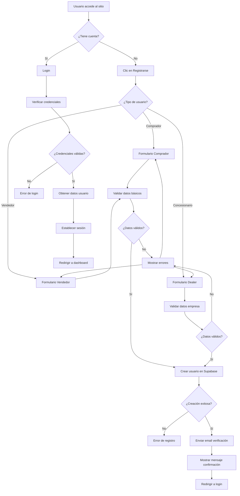
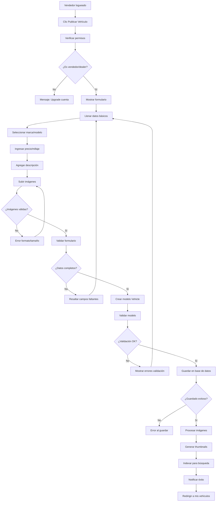
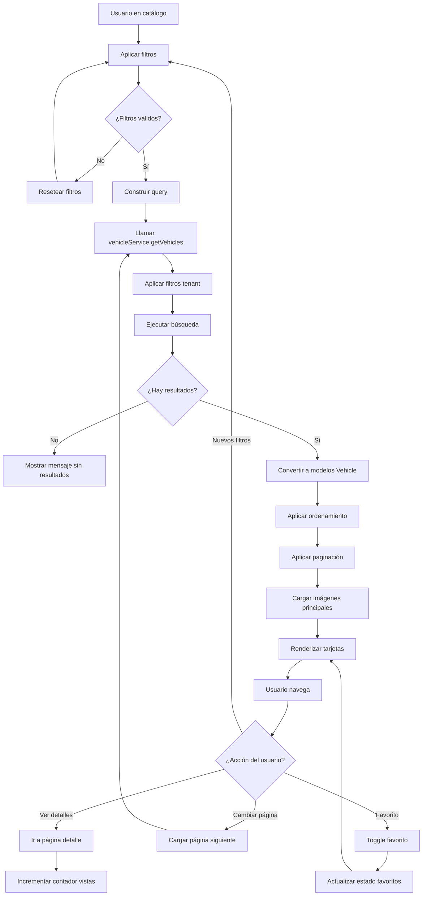
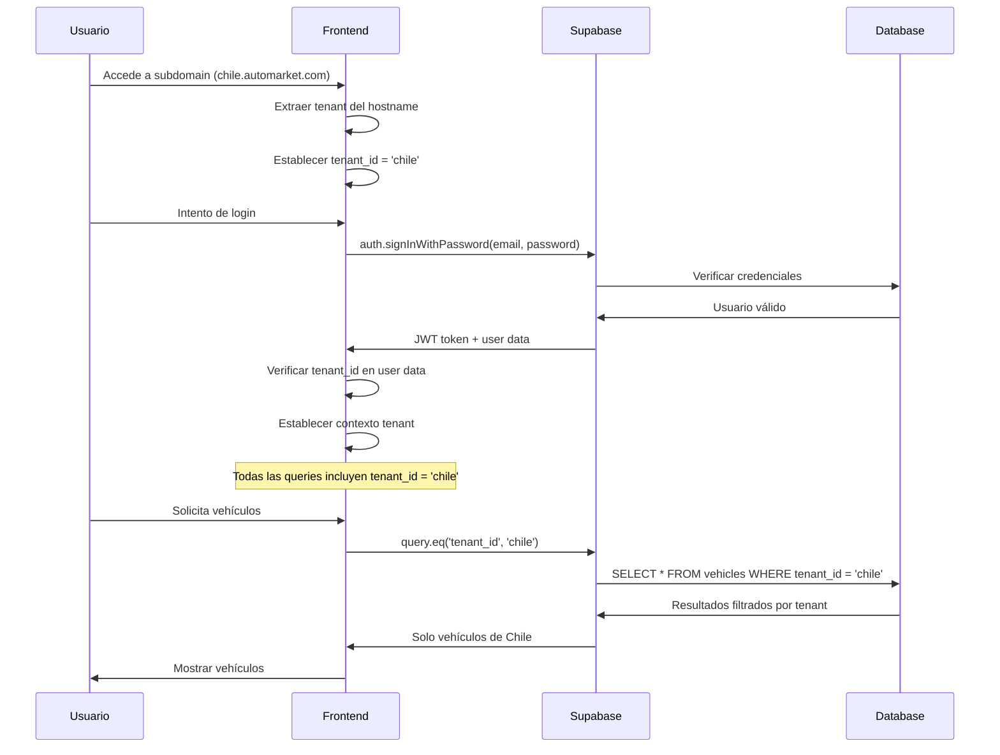
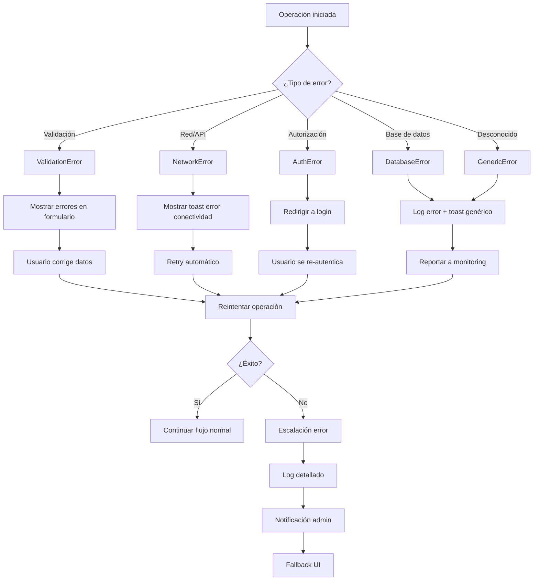
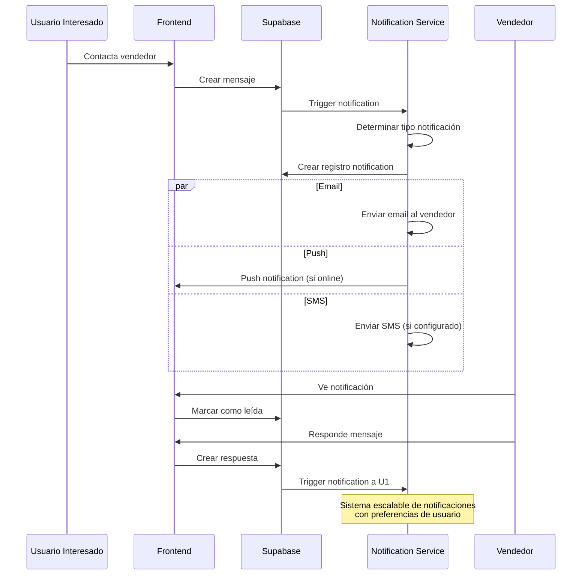

# Diagramas de Flujos de Trabajo - Automarket Multitenant

## 17. Flujo de Registro de Usuario



## 18. Flujo de Publicación de Vehículo



## 19. Flujo de Búsqueda de Vehículos



## 20. Flujo de Autenticación Multi-Tenant



## 21. Flujo de Validación de Modelos

```mermaid
flowchart TD
    A[Crear instancia modelo] --> B[Constructor BaseModel]
    B --> C[Generar UUID si no existe]
    C --> D[Establecer timestamps]
    D --> E[Asignar propiedades específicas]
    
    E --> F[Llamar validate()]
    F --> G[Validar campos obligatorios]
    G --> H[Validar tipos de datos]
    H --> I[Validar reglas de negocio]
    
    I --> J{¿Todas las validaciones OK?}
    J -->|No| K[Recopilar errores]
    K --> L[Retornar ValidationResult con errores]
    
    J -->|Sí| M[Retornar ValidationResult success]
    
    subgraph "Validaciones Específicas"
        N[User: Email format, phone format]
        O[Vehicle: Year range, price > 0, mileage >= 0]
        P[Tenant: Country code, currency, timezone]
    end
    
    I --> N
    I --> O  
    I --> P
```

## 22. Flujo de Manejo de Errores



## 23. Flujo de Optimización de Imágenes

```mermaid
flowchart TD
    A[Usuario sube imagen] --> B[Validar archivo]
    B --> C{¿Formato válido?}
    
    C -->|No| D[Error formato]
    C -->|Sí| E{¿Tamaño válido?}
    
    E -->|No| F[Error tamaño]
    E -->|Sí| G[Crear preview local]
    
    G --> H[Mostrar preview]
    H --> I[Usuario confirma]
    I --> J[Subir a Supabase Storage]
    
    J --> K[Generar URL pública]
    K --> L[Trigger función servidor]
    
    L --> M[Crear thumbnail (300x200)]
    M --> N[Crear imagen medium (800x600)]
    N --> O[Crear imagen large (1200x900)]
    
    O --> P[Guardar URLs en BD]
    P --> Q[Actualizar modelo Vehicle]
    Q --> R[Notificar frontend]
    R --> S[Actualizar UI]
    
    subgraph "Optimizaciones"
        T[WebP conversion]
        U[Compresión automática]
        V[CDN distribution]
        W[Lazy loading]
    end
    
    M --> T
    N --> T
    O --> T
    K --> V
    S --> W
```

## 24. Flujo de Notifications System (Futuro)

