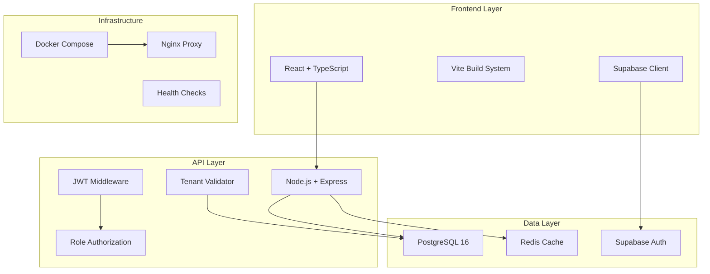

# AutoMarket MultiTenant - Sistema Completo de Gestión Vehicular

<div align="center">


[](https://nodejs.org/)
[](https://reactjs.org/)
[](https://www.typescriptlang.org/)
[](https://www.postgresql.org/)
[](https://redis.io/)
[](https://www.docker.com/)
[](LICENSE)

**Sistema multi-tenant para gestión de concesionarias y venta de vehículos con 4 tipos de usuario diferenciados**

[🚀 Inicio Rápido](#-inicio-rápido) •
[📚 Documentación](#-documentación) •
[🛠️ Desarrollo](#️-desarrollo) •
[🐳 Docker](#-docker)

</div>

---

## 🌟 Características Principales

### 🏢 **Sistema Multi-Tenant**
- **Aislamiento completo** entre organizaciones
- **4 tipos de usuario** con permisos diferenciados
- **Gestión independiente** por concesionaria
- **Datos seguros** con Row Level Security (RLS)

### 🚗 **Gestión de Vehículos**
- **Catálogo completo** con especificaciones técnicas
- **Galería de imágenes** con soporte multi-formato
- **Sistema de características** personalizable
- **Estados de venta** (disponible, vendido, reservado)

### 👥 **Tipos de Usuario**

| Tipo | Descripción | Permisos |
|------|-------------|----------|
| **🛒 Comprador** | Usuario final | Solo lectura en todos los tenants |
| **👤 Vendedor Particular** | Vendedor independiente | CRUD en su propio tenant |
| **🏪 Vendedor Automotora** | Empleado de concesionaria | CRUD en vehículos de su automotora |
| **👑 Admin Automotora** | Administrador de concesionaria | Control total de su automotora |

### 🔒 **Seguridad y Autenticación**
- **Supabase Auth** con JWT
- **Row Level Security** en PostgreSQL
- **Middleware de autorización** por rol
- **Validación de tenant** en cada request

### 📊 **Dashboard y Analytics**
- **Métricas en tiempo real** por tenant
- **Estadísticas de ventas** y rendimiento
- **Gráficos interactivos** de datos
- **Cache inteligente** con Redis

---

## 🏗️ Arquitectura del Sistema



---

## 🚀 Inicio Rápido

### Prerrequisitos

- **Docker Desktop** 20.10+
- **Node.js** 18+ (para desarrollo local)
- **Git** para clonar el repositorio

### Instalación con Docker (Recomendado)

```bash
# 1. Clonar el repositorio
git clone https://github.com/EstebanSalgad0/automarket-multitenant.git
cd automarket-multitenant

# 2. Configurar variables de entorno
cp .env.example .env
# Editar .env con tus configuraciones

# 3. Ejecutar script de desarrollo
# En Windows:
.\scripts\dev.bat start

# En Linux/Mac:
chmod +x scripts/dev.sh
./scripts/dev.sh start
```

### Instalación Manual

```bash
# 1. Base de datos
docker-compose up -d database redis

# 2. API Backend
cd api
npm install
npm run dev

# 3. Frontend (en otra terminal)
cd app
npm install
npm run dev
```

### 🌐 Acceso a Servicios

| Servicio | URL | Descripción |
|----------|-----|-------------|
| **Frontend** | http://localhost:5173 | Aplicación React |
| **API Docs** | http://localhost:3001/api-docs | Documentación Swagger |
| **Health Check** | http://localhost:3001/health | Estado de la API |
| **Database** | localhost:5432 | PostgreSQL |
| **Redis** | localhost:6379 | Cache y sesiones |

---

## 📁 Estructura del Proyecto

```
automarket-multitenant/
├── 📱 app/                    # Frontend React + TypeScript
│   ├── src/
│   │   ├── components/        # Componentes React
│   │   ├── hooks/            # Custom hooks
│   │   ├── lib/              # Configuraciones (Supabase)
│   │   └── services/         # Servicios de API
│   ├── Dockerfile            # Container del frontend
│   └── nginx.conf           # Configuración Nginx
│
├── 🔧 api/                    # Backend Node.js + Express
│   ├── src/
│   │   ├── routes/           # Endpoints de la API
│   │   ├── middleware/       # Auth, validation, etc.
│   │   ├── config/           # Supabase, Redis config
│   │   └── server.js         # Servidor principal
│   ├── Dockerfile            # Container del backend
│   └── package.json          # Dependencias Node.js
│
├── 🗄️ db/                     # Base de datos
│   ├── init.sql              # Configuración inicial
│   ├── schema_complete.sql   # Esquema completo
│   └── migration_*.sql       # Migraciones
│
├── 📚 docs/                   # Documentación
│   ├── api/                  # Docs de API
│   ├── deployment/           # Guías de deployment
│   └── security/             # Documentación de seguridad
│
├── 🔧 scripts/                # Scripts de automatización
│   ├── dev.sh               # Script desarrollo (Linux/Mac)
│   └── dev.bat              # Script desarrollo (Windows)
│
├── 🐳 docker-compose.yml      # Orquestación de servicios
├── 📋 README.md              # Este archivo
└── ⚙️ .env.example           # Variables de entorno
```

---

## 🛠️ Desarrollo

### Variables de Entorno

Copia `.env.example` a `.env` y configura:

```bash
# Supabase (Requerido)
VITE_SUPABASE_URL=tu_url_de_supabase
VITE_SUPABASE_ANON_KEY=tu_clave_anonima
SUPABASE_SERVICE_ROLE_KEY=tu_clave_de_servicio

# Base de datos
POSTGRES_PASSWORD=tu_password_seguro
REDIS_PASSWORD=tu_redis_password

# Frontend
VITE_DEFAULT_TENANT=demo
VITE_APP_TITLE=AutoMarket MultiTenant
```

### Comandos Útiles

```bash
# Desarrollo
npm run dev          # Iniciar frontend
npm run dev:api      # Iniciar API
npm run build        # Build de producción

# Docker
docker-compose up -d                    # Todos los servicios
docker-compose --profile development up # Solo desarrollo
docker-compose logs -f                  # Ver logs

# Base de datos
npm run db:migrate   # Ejecutar migraciones
npm run db:seed      # Datos de prueba
npm run db:reset     # Reset completo
```

### 🧪 Testing

```bash
# API Tests
cd api
npm test                    # Tests unitarios
npm run test:integration    # Tests de integración

# Frontend Tests
cd app
npm test                    # Tests con Jest
npm run test:e2e           # Tests end-to-end
```

---

## 📚 Documentación API

### 🔐 Autenticación

```javascript
// Login
POST /api/auth/login
{
  "email": "usuario@example.com",
  "password": "password123"
}

// Response
{
  "success": true,
  "data": {
    "user": { "id": "...", "role": "comprador" },
    "session": { "access_token": "..." }
  }
}
```

### 🚗 Gestión de Vehículos

```javascript
// Listar vehículos de un tenant
GET /api/{tenantId}/vehicles?page=1&limit=10&brand=Toyota

// Crear vehículo
POST /api/{tenantId}/vehicles
{
  "brand": "Toyota",
  "model": "Corolla",
  "year": 2023,
  "price": 25000,
  "mileage": 5000,
  "fuel_type": "gasoline"
}
```

### 📊 Dashboard

```javascript
// Métricas del tenant
GET /api/{tenantId}/dashboard?period=30d

// Estadísticas detalladas
GET /api/{tenantId}/dashboard/stats
```

**📖 Documentación completa:** http://localhost:3001/api-docs

---

## 🐳 Docker y Deployment

### Desarrollo

```bash
# Perfil de desarrollo (hot reload)
docker-compose --profile development up -d

# Ver logs en tiempo real
docker-compose logs -f frontend-dev
```

### Producción

```bash
# Build de producción
docker-compose build --no-cache

# Deploy
docker-compose up -d frontend database redis

# Con certificados SSL
docker-compose -f docker-compose.yml -f docker-compose.prod.yml up -d
```

### Escalabilidad

```bash
# Múltiples instancias de API
docker-compose up -d --scale api=3

# Load balancer automático
docker-compose up -d nginx-lb
```

---

## 🔧 Configuración Avanzada

### Supabase Setup

1. **Crear proyecto** en [supabase.com](https://supabase.com)
2. **Ejecutar SQL** desde `db/schema_complete.sql`
3. **Configurar RLS** para seguridad multi-tenant
4. **Obtener claves** de API

### Redis Configuración

```bash
# Configuración optimizada para producción
REDIS_MAXMEMORY=512mb
REDIS_MAXMEMORY_POLICY=allkeys-lru
REDIS_SAVE="900 1 300 10 60 10000"
```

### Nginx Tuning

- **Gzip compression** habilitado
- **Static asset caching** optimizado
- **Security headers** configurados
- **Rate limiting** implementado

---

## 🚀 Roadmap

### Versión 1.1
- [ ] **Chat en tiempo real** entre compradores y vendedores
- [ ] **Sistema de citas** para pruebas de manejo  
- [ ] **Integración con WhatsApp** Business
- [ ] **Reportes avanzados** con exportación PDF

### Versión 1.2
- [ ] **App móvil** React Native
- [ ] **Integración con MercadoPago/Stripe**
- [ ] **Sistema de financing**
- [ ] **ML para recomendaciones**

### Versión 2.0
- [ ] **Marketplace público**
- [ ] **API para terceros**
- [ ] **Sistema de subastas**
- [ ] **Blockchain para historial**

---

## 🤝 Contribuir

1. **Fork** el proyecto
2. **Crear branch** (`git checkout -b feature/nueva-funcionalidad`)
3. **Commit** cambios (`git commit -am 'Agregar nueva funcionalidad'`)
4. **Push** al branch (`git push origin feature/nueva-funcionalidad`)
5. **Crear Pull Request**

### Guías de Contribución

- ✅ **Tests** para toda nueva funcionalidad
- 📝 **Documentación** actualizada
- 🎨 **Código** siguiendo estándares del proyecto
- 🔍 **Code review** antes de merge

---

## 📞 Soporte

- **📧 Email:** soporte@automarket.com
- **💬 Discord:** [AutoMarket Community](https://discord.gg/automarket)
- **📚 Wiki:** [docs.automarket.com](https://docs.automarket.com)
- **🐛 Issues:** [GitHub Issues](https://github.com/EstebanSalgad0/automarket-multitenant/issues)

---

## 📜 Licencia

Este proyecto está bajo la licencia MIT. Ver [LICENSE](LICENSE) para más detalles.

---

<div align="center">

**Hecho con ❤️ por el equipo AutoMarket**

[⬆️ Volver arriba](#automarket-multitenant---sistema-completo-de-gestión-vehicular)

</div>